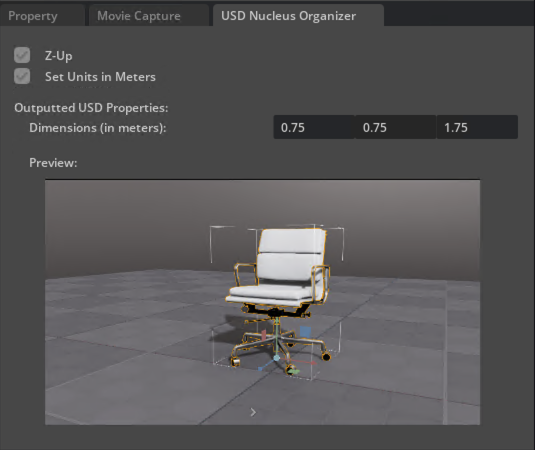

# USD Nucleus Organizer extension for NVIDIA Omniverse

This project is to standardize the asset import process for GliaCloud's R&D purposes (currently only for internal use).

Namely, it will:

1. Run asset converter on selected files with GliaCloud's desired configuration.
2. Create Nucleus (or USDSearch) tags using an automated method (TBD).
3. Place the asset at the desired path within our Nucleus server.

## Enable extension
1. Fork and clone this repo, for example in `C:\Users\gliacloud\Documents\Omniverse-Projects\usd-nucleus-organizer`.
2. In the Omniverse App, open Extension Manager: Window → Extensions.
3. In the Extension Manager Window open the settings page, found at the small gear button in the top left bar.
4. In the settings page there is a list of Extension Search Paths. Add the path to the exts subfolder of the cloned repo as another search path: `C:\Users\gliacloud\Documents\Omniverse-Projects\usd-nucleus-organizer\exts`
5. Navigate to the Third Party tab of the Extensions Manager and find the newly-added `omni.usd.nucleus.organizer` extension. Toggle on the extension and check 'Autoload' if desired.

## Run tests
TODO:

## Import and convert files

TODO:
current code references:
    omni.kit.tool.asset_importer
    omni.kit.property.usd
    omni.kit.renderer.imgui

    omni.ui -- c:/users/gliacloud/appdata/local/ov/pkg/create-2023.2.5/extscache/omni.ui-2.18.6+ece658d9.wx64.r.cp310/omni/ui/__init__.py
