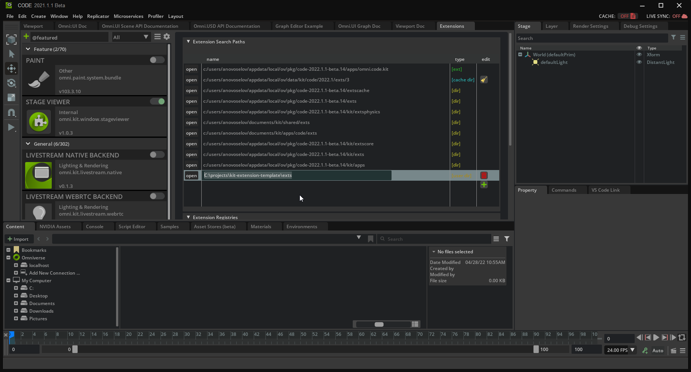

# GliaCloud Co. Ltd. x NVIDIA Omniverse Collaboration
---------------------
This extension extracts ground truth data, including Depth Maps, Segmentation detection... 

Exported them to ComfyUI, enabling enhanced image processing and generation workflows.

# Getting started
---------------------
1. add ext to omniverse


2. link custom node for comfyui

    for example... 
    ```
    ln -s ./exts/omni.comfyui.connector.core-0.1.0/omni/comfyui/connector/core/omni_nodes.py (Your_ComfyUI_PATH)/custom_nodes/omni_nodes.py
    ```

# Using the extension
----------------------


# To Do
----------------------
- [ ] Animation Start Frame & End Frame Control  
- [ ] OpenPose Detect  
- [ ] Edge Detect  